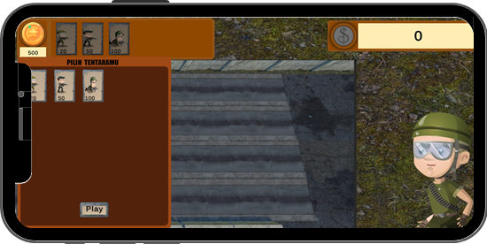
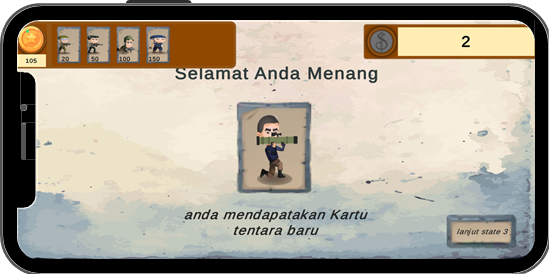
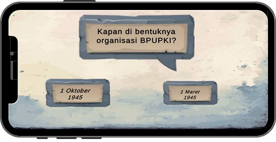

# APLIKASI PERMAINAN TOWER DEFENSE UNTUK PENGENALAN PERISTIWA SEJARAH KEMERDEKAAN INDONESIA 1945

Aplikasi apa yang dibuat, Kami akan membuat Game Defense Tower Untuk Pengenalan Peristiwa Sejarah, Siapa terget penguna aplikasi ini akan kami rancang untuk anak Sekolah Dasar/SD dan Sekolah Menengah Pertama/SMP dan kami harapkan pengguna didampingi oleh orang tuanya, Apa saja fitur pada aplikasi ini, Kami memiliki beberapa Fitur pada game ini, Pertama Start. Fitur Start untuk memulai game defense Tower untuk pengenalan sejarah pada fitur ini player akan mengontrol permainan agar lawan tidak melewati atau sampai ke Defense tower player.kami memiliki 3 stage jika stage berhasil player akan diberi reword berupa peristiwa sejarah yang bertujuan untuk pengenalan peristiwa sejarah dan diakhir game kami akan memberikan tanya jawab seputar reword setiap stage agar game ini berguna dalam edukasi.

Tampilan Utama                              | Tampilan Kata                              | Tampilan Praktik
--------------------------------------------|--------------------------------------------|--------------------------------------------
 | |

### Link Berkas PA

(diisi link Google Drive kelompok PA yang telah disiapkan oleh Tim PA)

### Susunan Tim

Nama                                    | Username Github | Posisi
----------------------------------------|-----------------|-----------
Haafizh hamda                           | HaafizHhamda    | Mahasiswa
Siva Nur Samrotissa`Adah                | Sivanurs        | Mahasiswa
Rizza Indah Mega Mandasari, S.Kom., MT. | usernamePbb     | Pembimbing
Nama Reviewer                           | usernameRev     | Reviewer
